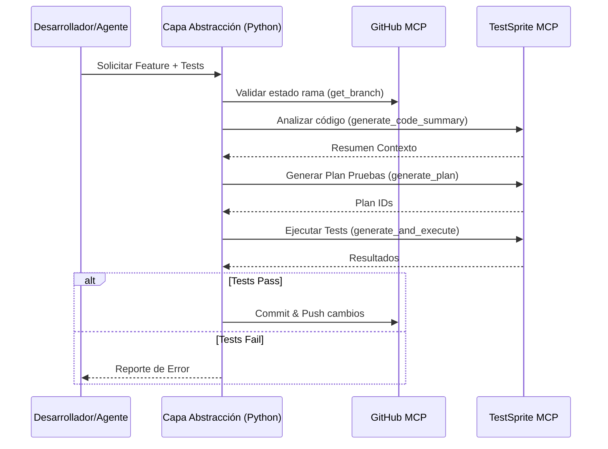

# Plan Maestro: Portal de Casos de Uso e Integración MCP

Este documento consolida la estrategia de implementación para dos iniciativas críticas: el desarrollo del portal web de "Casos de Uso" para demostración de valor, y la integración técnica operativa de los servidores MCP (Model Context Protocol) para potenciar el flujo de trabajo de desarrollo y pruebas.

---

## SECCIÓN A: Portal de Casos de Uso Interactivo

Transformación de la documentación técnica en una experiencia de conversión mediante storytelling visual y demostraciones interactivas.

### 1. Arquitectura y Estructura de Archivos
- **`docs/pages/use-cases.html`**: Landing page principal tipo SPA.
- **`docs/css/use-cases.css`**: Estilos aislados para componentes de marketing (Hero, Cards, Sliders).
- **`docs/js/use-cases.js`**: Lógica para gráficos (Chart.js), diagramas (Mermaid) y animaciones.
- **Assets**: `docs/assets/img/sectors/{ecommerce,health,education}/`.

### 2. Estrategia de Diseño y UX
- **Navegación**: Enlace "Casos de Uso" en sidebar global + Sub-navegación sticky por sector.
- **Interactividad**:
  - **Comparativa Visual**: Sliders "Before/After".
  - **KPIs Animados**: Contadores de métricas de éxito.
  - **Diagramas Vivos**: Renderizado dinámico de flujos con Mermaid.js.

### 3. Detalle de Casos de Uso (Sectores)
1.  **Ecommerce ("RetailSync")**: Automatización de pedidos -> Calendario -> Email. KPI: -40% tickets soporte.
2.  **Salud ("MediGraph")**: Sincronización Outlook <-> Portal Pacientes. KPI: 0% citas duplicadas.
3.  **Educación ("EduDrive")**: Entrega de tareas a OneDrive + Teams. KPI: 100% digitalización.

### 4. Requisitos Técnicos
- **SEO**: Schema.org (`SoftwareApplication`), Open Graph tags.
- **Performance**: Lazy loading, WebP, defer scripts.
- **Analytics**: Tracking de eventos en botones de demostración.

---

## SECCIÓN B: Integración y Operación de Servidores MCP

Plan detallado para la incorporación y gestión de los servidores `testsprite` y `GITHUB` en el ciclo de vida del desarrollo.

### 1. Análisis del Estado Actual
- **GitHub MCP**:
  - **Estado**: Activo y Conectado.
  - **Capacidades**: Búsqueda de repositorios, lectura de contenidos, creación de ramas/PRs, gestión de issues.
  - **Verificación**: Conexión exitosa con el repositorio `ms-graph-api-demo`.
- **TestSprite MCP**:
  - **Estado**: Activo, requiere inicialización (bootstrap).
  - **Capacidades**: Generación de resúmenes de código, planes de prueba (frontend/backend), ejecución de tests y análisis de resultados.
  - **Dependencias**: Node.js, entorno de ejecución local para pruebas.

### 2. Documentación Técnica de Endpoints

#### GITHUB MCP
| Método/Tool | Descripción | Parámetros Clave |
|---|---|---|
| `search_repositories` | Busca repositorios públicos/privados | `query` (string) |
| `get_file_contents` | Lee archivos o directorios | `owner`, `repo`, `path`, `branch` |
| `create_or_update_file` | Escribe cambios en archivos | `owner`, `repo`, `path`, `content`, `message`, `sha` |
| `create_pull_request` | Crea un PR | `owner`, `repo`, `title`, `head`, `base` |

#### TESTSPRITE MCP
| Método/Tool | Descripción | Parámetros Clave |
|---|---|---|
| `testsprite_bootstrap` | Inicializa el entorno de pruebas | `projectPath`, `localPort`, `type` (backend/frontend) |
| `testsprite_generate_code_summary` | Analiza el codebase para contexto | `projectRootPath` |
| `testsprite_generate_backend_test_plan` | Crea plan de pruebas backend | `projectPath` |
| `testsprite_generate_code_and_execute` | Genera y ejecuta los tests | `projectName`, `testIds` |

### 3. Arquitectura de Integración
La integración seguirá un patrón de **Orquestación Asistida**:

### 4. Capa de Abstracción (Implementation Layer)
Se desarrollará un módulo `dev_ops/mcp_wrapper.py` que estandarice las llamadas:
- **Clase `MCPClient`**: Maneja la conexión y autenticación.
- **Métodos Unificados**: `run_test_suite()`, `sync_repo_state()`.
- **Resiliencia**: Implementación de patrón *Retry* (3 intentos con backoff exponencial) para timeouts de red.

### 5. Manejo de Errores Robustos
Sistema de captura de excepciones categorizado:
- **`NetworkError`**: Fallo de conexión con servidores MCP. (Acción: Reintento automático).
- **`AuthError`**: Token expirado o permisos insuficientes. (Acción: Alerta inmediata, detener pipeline).
- **`ValidationError`**: Parámetros inválidos en tool calls. (Acción: Log detallado, feedback al usuario).
- **`BusinessLogicError`**: Fallo en tests o conflictos de merge. (Acción: Generar reporte de incidencia).

### 6. Monitoreo en Tiempo Real
Implementación de un dashboard de salud simple (`dev_ops/health_check.py`):
- **Latencia**: Ping a endpoints básicos (`list_repos`, `get_status`) cada 5 min.
- **Disponibilidad**: Alerta si >3 fallos consecutivos.
- **Alertas**: Notificación a consola/log si el tiempo de respuesta > 2s.

### 7. Suite de Pruebas Automatizadas
Para validar la propia integración MCP:
- **Test de Conectividad**: Verificar handshake con ambos servidores.
- **Test de Flujo Completo (Mock)**: Simular ciclo "Leer GitHub -> Generar Test -> Reportar Resultado".
- **Prueba de Carga**: Ejecutar 10 peticiones concurrentes de lectura para verificar estabilidad.

### 8. Procedimientos de Despliegue y Rollback
- **Despliegue**: Actualizaciones de configuración MCP se aplican primero en rama `dev-mcp`.
- **Rollback**: Script `restore_mcp_config.ps1` que revierte a la última configuración conocida de `mcp_config.json`.
- **Continuidad**: Los servidores MCP corren como procesos independientes; su reinicio no debe detener el servidor de desarrollo local.

### 9. Documentación de Operaciones (Runbooks)
- **Problema: TestSprite no responde**:
  1. Verificar proceso Node.js.
  2. Ejecutar `testsprite_bootstrap` nuevamente.
  3. Revisar puerto 5173 (o configurado).
- **Problema: GitHub MCP Timeout**:
  1. Verificar conexión internet.
  2. Validar token PAT en variables de entorno.
- **Métricas Clave**: Tasa de éxito de tool calls, tiempo promedio de generación de tests.

### 10. Criterios de Éxito
- **Disponibilidad**: 99.9% uptime durante sesiones de desarrollo.
- **Latencia**: Respuestas de herramientas de lectura < 200ms.
- **Cobertura**: TestSprite capaz de cubrir > 80% de las nuevas funciones generadas.
- **Eficiencia**: Reducción del 50% en tiempo de configuración de boilerplate de pruebas.
