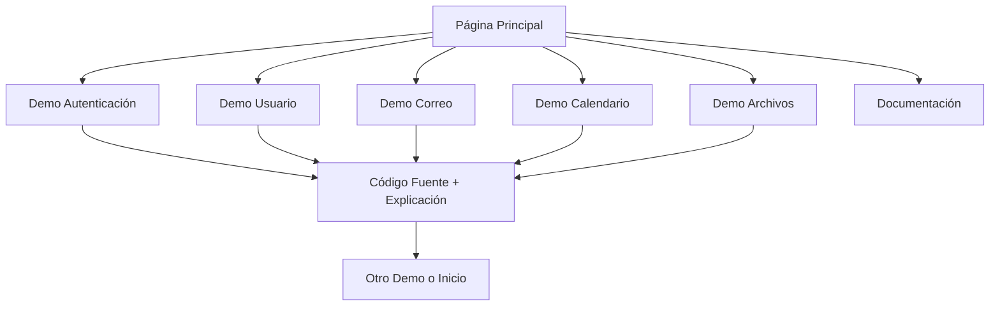

## 1. Product Overview
Sitio web estático alojado en GitHub Pages que demuestra casos de uso de Microsoft Graph API de forma interactiva. El proyecto educativo permite a desarrolladores explorar y entender las capacidades de Microsoft Graph API a través de ejemplos ejecutables en el navegador.

Problema a resolver: Falta de recursos interactivos para aprender Microsoft Graph API. Usuarios: Desarrolladores web que necesitan integrar servicios de Microsoft 365. Valor: Reduce curva de aprendizaje con demos prácticas y código fuente visible.

## 2. Core Features

### 2.1 User Roles
No se requieren roles de usuario específicos. El sitio es público y accesible para todos los desarrolladores interesados.

### 2.2 Feature Module
El demostrativo de Microsoft Graph API incluye las siguientes páginas principales:

1. **Página principal**: Hero section, navegación a casos de uso, descripción general de Microsoft Graph API
2. **Página de autenticación**: Demo de OAuth 2.0, manejo de tokens, flujo de autorización
3. **Página de usuario**: Información de perfil, gestión de usuarios, permisos
4. **Página de correo**: Listado de mensajes, envío de emails, gestión de carpetas
5. **Página de calendario**: Vista de eventos, creación de reuniones, gestión de disponibilidad
6. **Página de archivos**: Explorador de OneDrive, upload/download, compartir documentos
7. **Página de documentación**: Guías paso a paso, mejores prácticas, referencias de API

### 2.3 Page Details
| Page Name | Module Name | Feature description |
|-----------|-------------|---------------------|
| Página principal | Hero section | Presentación visual de Microsoft Graph API con animaciones suaves y llamada a la acción |
| Página principal | Navegación | Menú responsive con enlaces a cada caso de uso y documentación |
| Página principal | Tarjetas de casos de uso | Vista previa interactiva de cada funcionalidad con iconos y descripciones |
| Página de autenticación | Demo OAuth | Simulación del flujo de autenticación con Microsoft Identity Platform |
| Página de autenticación | Visualización de tokens | Muestra de tokens JWT decodificados y explicación de claims |
| Página de autenticación | Código fuente | Editor de código con sintaxis highlighting mostrando implementación real |
| Página de usuario | Perfil de usuario | Display de información del usuario con datos mock (nombre, email, foto) |
| Página de usuario | Permisos y scopes | Lista interactiva de permisos necesarios para cada operación |
| Página de correo | Bandeja de entrada | Lista de emails con preview, remitente y fecha en formato mock |
| Página de correo | Componer email | Formulario interactivo para crear y enviar mensajes (simulado) |
| Página de correo | Gestión de carpetas | Árbol de carpetas con drag & drop para organizar mensajes |
| Página de calendario | Vista mensual | Calendario interactivo con eventos mostrados en grid |
| Página de calendario | Crear evento | Formulario para nuevos eventos con validación de fechas |
| Página de calendario | Detalles de evento | Modal con información completa del evento y asistentes |
| Página de archivos | Explorador de archivos | Vista de árbol/archivos de OneDrive con iconos por tipo |
| Página de archivos | Upload/Download | Botones simulados para transferencia de archivos |
| Página de archivos | Compartir | Generación de links de compartición con permisos configurables |
| Página de documentación | Guías paso a paso | Instrucciones detalladas con capturas de pantalla para cada caso de uso |
| Página de documentación | Diagramas de flujo | Visualizaciones interactivas del flujo de cada operación |
| Página de documentación | Referencias de API | Links a documentación oficial de Microsoft Graph |

## 3. Core Process

### Flujo del Usuario Principal
1. Usuario accede al sitio desde GitHub Pages
2. Explora la página principal con descripción general
3. Selecciona un caso de uso específico desde la navegación
4. Interactúa con el demo funcional del caso seleccionado
5. Examina el código fuente mostrado en el editor integrado
6. Lee la documentación detallada con pasos y explicaciones
7. Puede navegar entre diferentes casos de uso o volver al inicio

## 4. User Interface Design

### 4.1 Design Style
- **Colores primarios**: Azul Microsoft (#0078d4), Blanco (#ffffff)
- **Colores secundarios**: Gris claro (#f3f2f1), Negro (#323130)
- **Estilo de botones**: Bordes redondeados, hover effects, sombras sutiles
- **Tipografía**: Segoe UI (fuente nativa de Microsoft), tamaños 14-24px
- **Layout**: Diseño card-based con grid responsive, navegación superior sticky
- **Iconos**: Fluent UI System icons (estilo Microsoft moderno)

### 4.2 Page Design Overview
| Page Name | Module Name | UI Elements |
|-----------|-------------|-------------|
| Página principal | Hero section | Background gradient azul-negro, logo Microsoft Graph, título animado, subtítulo descriptivo, CTA principal |
| Página principal | Navegación | Barra superior sticky con logo, menú horizontal, responsive hamburger para móvil, sombra sutil |
| Página principal | Tarjetas casos de uso | Grid 2x2 en desktop, 1 columna en móvil, cards con iconos grandes, título, descripción corta, botón "Ver demo" |
| Demo autenticación | Panel OAuth | Ventana simulada de login de Microsoft, botones de autorización, indicador de progreso del flujo |
| Demo autenticación | Token viewer | Editor de código con sintaxis highlighting, panel lateral con explicación de cada claim |
| Demo correo | Bandeja de entrada | Lista scrollable con items de email, avatar del remitente, preview del mensaje, timestamp |
| Demo calendario | Vista calendario | Grid de días del mes, eventos coloreados por categoría, navegación entre meses |
| Demo archivos | Explorador | Vista split-pane con árbol de carpetas izquierda, contenido derecha, toolbar con acciones |
| Documentación | Contenido | Layout con sidebar de navegación, contenido principal con headers jerárquicos, código inline |

### 4.3 Responsiveness
- **Desktop-first**: Diseño optimizado para pantallas grandes (1920x1080)
- **Mobile-adaptive**: Breakpoints en 768px y 480px con reorganización de layout
- **Touch optimization**: Botones mínimo 44px, espaciado generoso, gestos swipe en carruseles

### 4.4 3D Scene Guidance
No aplicable - El proyecto utiliza diseño 2D moderno con animaciones CSS y transiciones suaves.