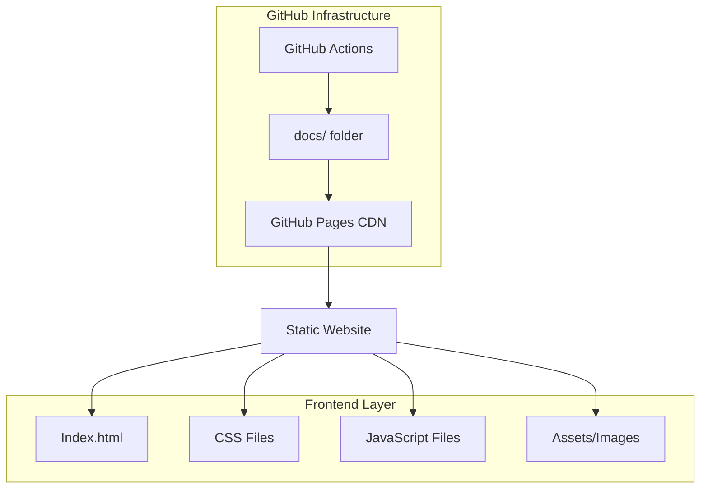

## 1. Architecture design



## 2. Technology Description

- **Frontend**: HTML5 + CSS3 + Vanilla JavaScript (ES6+)
- **Build Tool**: None (sitio estático puro)
- **Deployment**: GitHub Pages (via docs/ folder)
- **Version Control**: Git con GitHub
- **CSS Framework**: CSS Grid + Flexbox (nativo)
- **JavaScript Libraries**: Prism.js (syntax highlighting), Chart.js (visualizaciones)
- **Iconos**: Fluent UI System Icons (CDN)
- **Fonts**: Segoe UI (system font stack)

## 3. Route definitions

| Route | Purpose |
|-------|---------|
| /index.html | Página principal con navegación y descripción general |
| /auth-demo.html | Demo de autenticación OAuth 2.0 con Microsoft |
| /user-demo.html | Demo de información de usuario y perfil |
| /mail-demo.html | Demo de gestión de correos electrónicos |
| /calendar-demo.html | Demo de calendario y eventos |
| /files-demo.html | Demo de explorador de archivos OneDrive |
| /documentation.html | Página de documentación y guías |
| /css/styles.css | Estilos principales del sitio |
| /js/main.js | JavaScript principal y navegación |
| /js/auth-demo.js | Lógica del demo de autenticación |
| /js/user-demo.js | Lógica del demo de usuario |
| /js/mail-demo.js | Lógica del demo de correo |
| /js/calendar-demo.js | Lógica del demo de calendario |
| /js/files-demo.js | Lógica del demo de archivos |

## 4. API definitions

### 4.1 Mock API Functions

Las siguientes funciones simulan las respuestas de Microsoft Graph API:

```javascript
// Autenticación
function mockAuthLogin() {
  return {
    access_token: "eyJ0eXAiOiJKV1QiLCJhbGciOiJSUzI1NiIsIng1dCI6...",
    token_type: "Bearer",
    expires_in: 3600,
    scope: "User.Read Mail.Read Calendar.Read Files.Read"
  };
}

// Información del usuario
function mockGetUserProfile() {
  return {
    id: "12345678-1234-1234-1234-123456789012",
    displayName: "Juan Pérez",
    mail: "juan.perez@contoso.com",
    userPrincipalName: "juan.perez@contoso.com",
    jobTitle: "Ingeniero de Software",
    department: "Tecnología"
  };
}

// Lista de correos
function mockGetMessages() {
  return [
    {
      id: "msg1",
      subject: "Reunión de equipo - Proyecto Alpha",
      from: { emailAddress: { name: "María García", address: "maria@contoso.com" } },
      receivedDateTime: "2024-01-15T10:30:00Z",
      isRead: false,
      bodyPreview: "Hola equipo, les comparto la agenda para nuestra reunión de mañana..."
    },
    {
      id: "msg2", 
      subject: "Actualización del sprint",
      from: { emailAddress: { name: "Carlos Ruiz", address: "carlos@contoso.com" } },
      receivedDateTime: "2024-01-14T16:45:00Z",
      isRead: true,
      bodyPreview: "El sprint va según lo planeado, hemos completado el 80% de las historias..."
    }
  ];
}

// Eventos del calendario
function mockGetCalendarEvents() {
  return [
    {
      id: "event1",
      subject: "Reunión de planificación",
      start: { dateTime: "2024-01-16T09:00:00", timeZone: "UTC" },
      end: { dateTime: "2024-01-16T10:00:00", timeZone: "UTC" },
      location: { displayName: "Sala de conferencias A" },
      attendees: [
        { emailAddress: { name: "Juan Pérez", address: "juan@contoso.com" }, status: { response: "accepted" } }
      ]
    }
  ];
}

// Archivos de OneDrive
function mockGetDriveItems() {
  return [
    {
      id: "file1",
      name: "Documento_Proyecto.docx",
      size: 24576,
      createdDateTime: "2024-01-10T08:00:00Z",
      webUrl: "https://contoso.sharepoint.com/:w:/r/...",
      folder: undefined
    },
    {
      id: "folder1",
      name: "Presentaciones",
      size: 0,
      createdDateTime: "2024-01-08T10:30:00Z",
      folder: { childCount: 5 }
    }
  ];
}
```

## 5. Server architecture diagram

No aplicable - El proyecto es completamente estático sin componentes de servidor.

## 6. Data model

### 6.1 Mock Data Structure

```javascript
// Estructura de datos para simulación
const mockData = {
  user: {
    id: "string",
    displayName: "string",
    mail: "string",
    userPrincipalName: "string",
    jobTitle: "string",
    department: "string",
    officeLocation: "string",
    mobilePhone: "string"
  },
  
  messages: [{
    id: "string",
    subject: "string",
    from: {
      emailAddress: {
        name: "string",
        address: "string"
      }
    },
    toRecipients: [{ emailAddress: { name: "string", address: "string" } }],
    receivedDateTime: "ISO 8601 string",
    sentDateTime: "ISO 8601 string",
    isRead: "boolean",
    isDraft: "boolean",
    importance: "low|normal|high",
    bodyPreview: "string",
    body: {
      contentType: "text|html",
      content: "string"
    }
  }],
  
  events: [{
    id: "string",
    subject: "string",
    start: { dateTime: "ISO 8601 string", timeZone: "string" },
    end: { dateTime: "ISO 8601 string", timeZone: "string" },
    location: { displayName: "string" },
    attendees: [{
      emailAddress: { name: "string", address: "string" },
      status: { response: "none|accepted|declined|tentativelyAccepted" }
    }],
    organizer: {
      emailAddress: { name: "string", address: "string" }
    }
  }],
  
  driveItems: [{
    id: "string",
    name: "string",
    size: "number (bytes)",
    createdDateTime: "ISO 8601 string",
    lastModifiedDateTime: "ISO 8601 string",
    webUrl: "string",
    folder: { childCount: "number" },
    file: { mimeType: "string" }
  }]
};
```

### 6.2 GitHub Pages Configuration

```yaml
# .github/workflows/deploy.yml
name: Deploy to GitHub Pages
on:
  push:
    branches: [ main ]
  
jobs:
  deploy:
    runs-on: ubuntu-latest
    steps:
    - uses: actions/checkout@v3
    - name: Deploy to GitHub Pages
      uses: peaceiris/actions-gh-pages@v3
      with:
        github_token: ${{ secrets.GITHUB_TOKEN }}
        publish_dir: ./docs
```

```json
// docs/manifest.json (para PWA opcional)
{
  "name": "Microsoft Graph API Demo",
  "short_name": "Graph Demo",
  "start_url": "/index.html",
  "display": "standalone",
  "background_color": "#0078d4",
  "theme_color": "#0078d4",
  "icons": [
    {
      "src": "/images/icon-192.png",
      "sizes": "192x192",
      "type": "image/png"
    }
  ]
}
```

### 6.3 Estructura de Archivos

```
ms-graph-api-demo/
├── .github/
│   └── workflows/
│       └── deploy.yml
├── docs/
│   ├── index.html
│   ├── auth-demo.html
│   ├── user-demo.html
│   ├── mail-demo.html
│   ├── calendar-demo.html
│   ├── files-demo.html
│   ├── documentation.html
│   ├── css/
│   │   ├── styles.css
│   │   ├── prism.css
│   │   └── responsive.css
│   ├── js/
│   │   ├── main.js
│   │   ├── auth-demo.js
│   │   ├── user-demo.js
│   │   ├── mail-demo.js
│   │   ├── calendar-demo.js
│   │   ├── files-demo.js
│   │   └── mock-api.js
│   ├── images/
│   │   ├── logo-microsoft.png
│   │   ├── screenshots/
│   │   └── icons/
│   └── assets/
│       ├── flow-diagrams/
│       └── code-examples/
├── README.md
├── LICENSE
└── .gitignore
```