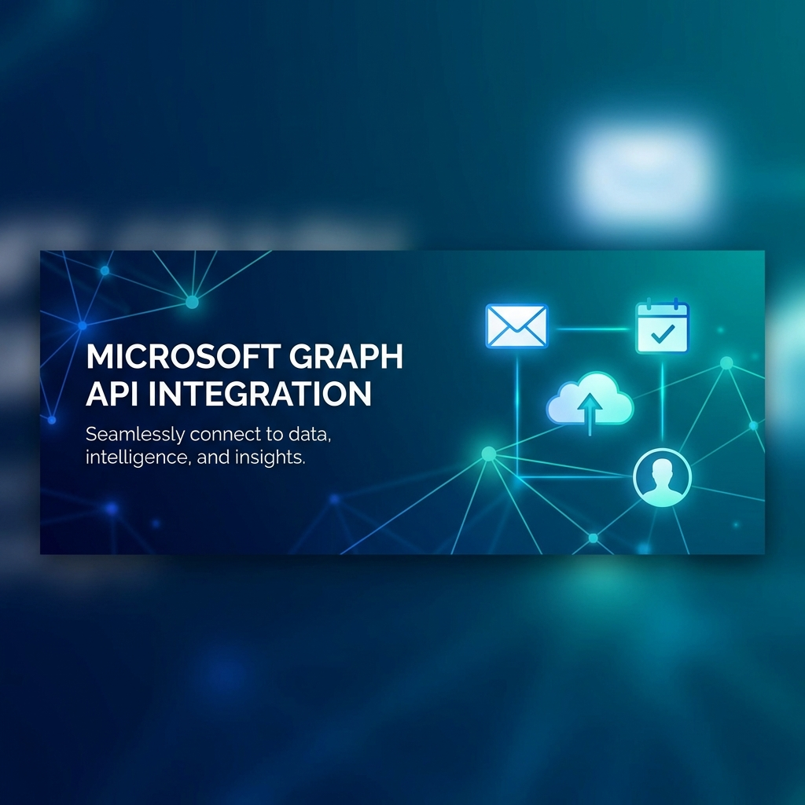

# Microsoft Graph API Demo (Refactored)



This is a robust, production-ready implementation of a Microsoft Graph API integration using FastAPI. It features a modular architecture, comprehensive error handling, and type-safe interactions with the Graph API.

**[🚀 View Interactive Demo](https://270803ggiztheking-rgb.github.io/ms-graph-api-demo/)**

## Features

- **Modular Architecture**: Clean separation of concerns (API, Services, Core, Models).
- **Authentication**: Secure OAuth 2.0 flow using MSAL.
- **Type Safety**: Full Pydantic models for request/response validation.
- **Error Handling**: Centralized exception handling and structured logging.
- **Docker Ready**: Includes Dockerfile and Docker Compose setup.
- **Testing**: Unit tests with pytest.
- **Interactive Demo**: A static frontend hosted on GitHub Pages that simulates the API.

## Project Structure

```
src/
├── api/                # API Endpoints
│   └── v1/
│       └── endpoints/  # Resource-specific routes (Auth, Users, Mail, etc.)
├── core/               # Core functionality (Config, Logging, GraphClient)
├── services/           # Business logic (AuthService, MailService, etc.)
├── models/             # Pydantic models (Domain entities)
└── main.py             # Application entry point

docs/                   # Static Demo Site (GitHub Pages)
├── css/
├── js/
├── pages/
└── index.html
```

## Setup (Backend)

1. **Clone the repository**
2. **Create .env file**
   Copy `.env.example` to `.env` and fill in your Azure AD credentials.
   ```env
   CLIENT_ID=your_client_id
   CLIENT_SECRET=your_client_secret
   TENANT_ID=your_tenant_id
   ```
3. **Install dependencies**
   ```bash
   pip install -r requirements.txt
   ```
4. **Run the application**
   ```bash
   uvicorn src.main:app --reload
   ```

## API Documentation

Once running, access the interactive API docs at:
- Swagger UI: http://localhost:8000/docs
- ReDoc: http://localhost:8000/redoc

## Interactive Demo Site

This repository includes a static website in the `docs/` folder that serves as a frontend demonstration of the project's capabilities. It uses a **Mock API** to simulate Microsoft Graph responses, allowing you to explore the UI flows without needing a live backend or Azure AD configuration.

### Running the Demo Locally

Simply open `docs/index.html` in your web browser.

### Deployment

The demo site is automatically deployed to GitHub Pages via GitHub Actions whenever changes are pushed to the `main` branch.

## Use Cases

### Authentication
- `/api/v1/auth/login`: Initiates OAuth flow.
- `/api/v1/auth/callback`: Handles token exchange.

### Users
- `GET /api/v1/users/me`: Get current user profile.

### Mail
- `GET /api/v1/mail/`: List emails.
- `POST /api/v1/mail/send`: Send an email.

### Calendar
- `GET /api/v1/calendar/`: List events.
- `POST /api/v1/calendar/`: Create an event.

### OneDrive
- `GET /api/v1/drive/files`: List files.
- `POST /api/v1/drive/files/upload`: Upload a file.

## Testing

Run tests with:
```bash
pytest
```
